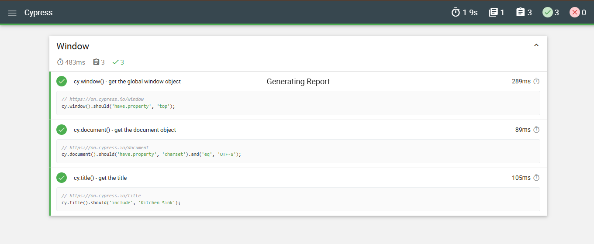

## Testes de inerface com Cypress

O seguinte repositorio realiza testes para o seguinte site: 

https://www.demoblaze.com/index.html

### Para instalação: 
````bash
npm install --save-dev cypress-multi-reporters mochawesome
````


### Para executar os testes:

```bash
cd .\Cypress\
npx cypress run
```

O relatório se encontra dentro do diretório : /Cypress/cypress/reports/html/mochawesome.html

###  Testes no cypress


### Exmeplo de um dos testes gerados



